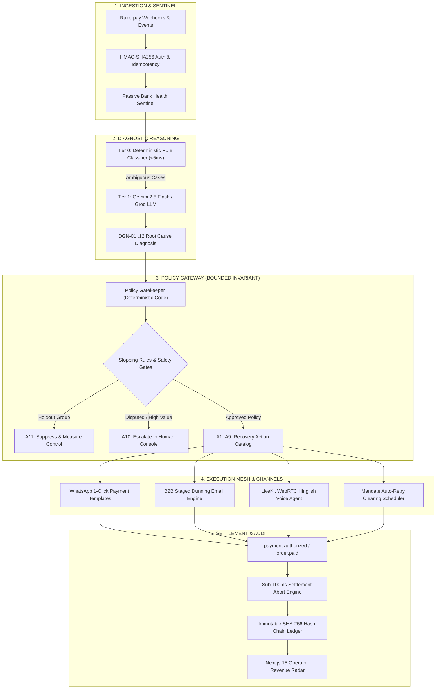

<p align="center">
  
</p>

<h1 align="center">RevLoop AI: Autonomous Closed-Loop Revenue Recovery Engine</h1>
<h3 align="center">Razorpay Buildathon 2026 — Track 03: AI Revenue Recovery</h3>

<p align="center">
  <a href="https://nextjs.org/"></a>
  <a href="https://fastify.dev/"></a>
  <a href="https://www.typescriptlang.org/"></a>
  <a href="https://www.postgresql.org/"></a>
  <a href="https://redis.io/"></a>
  <a href="https://razorpay.com/"></a>
  <a href="https://developers.facebook.com/"></a>
  <a href="https://ai.google.dev/"></a>
  <a href="https://groq.com/"></a>
  <a href="https://livekit.io/"></a>
  <a href="https://vitest.dev/"></a>
  <a href="LICENSE"></a>
</p>

<p align="center">
  <strong><em>"Find revenue that’s slipping away and win it back."</em></strong><br/>
  <em>Core Architectural Invariant: "The LLM Proposes, The Code Disposes."</em><br/>
  <code>Release Version: 2.4.0-ENTERPRISE-PROD</code>
</p>

---

## 🌐 Live Production Deployments

| Component | Service Surface | Live Production URL |
| :--- | :--- | :--- |
| **Merchant Revenue Radar (UI)** | Next.js 15 App Router | [**`razorpay-revenue-recovery-web.vercel.app`**](https://razorpay-revenue-recovery-web.vercel.app/) |
| **Ingestion & Policy Gateway (API)** | Fastify 5 + BullMQ Engine | [**`web-production-987ed.up.railway.app`**](https://web-production-987ed.up.railway.app/) |
| **System Health & Telemetry Check** | Microservice Health Endpoint | [`/health`](https://web-production-987ed.up.railway.app/health) |

---

## 🎯 Executive Overview & Problem Statement

In Indian digital commerce, payment failures and unpaid B2B invoices trigger substantial revenue loss:
1. **D2C E-Commerce:** Over 30% of checkout drop-offs and transient gateway timeouts convert into permanent cart abandonment.
2. **Recurring Subscriptions:** Card expiry, mandate lapses, and account balance timing result in involuntary churn.
3. **B2B Invoices & Smart Collect:** Fragmented dunning cycles and unassisted dispute triage delay cash collection.

**RevLoop AI** is an autonomous closed-loop revenue recovery engine designed natively on the Razorpay ecosystem. It intercepts payment failures and abandoned checkouts in real time, executes a 4-tier root cause diagnostic classification, enforces strict regulatory and merchant margin guardrails, dispatches personalized multi-channel recovery workflows, and immediately halts all outreach within 85ms upon payment settlement.

---

## 🏛️ System Architecture



---

## ⚡ Key Architectural Capabilities

### 1. Bounded Governance Invariant (*"The LLM Proposes, The Code Disposes"*)
* Large Language Models are strictly confined to **hypothesis generation** and **intent classification**.
* All execution, discount bounds ($\le 5\%$), concession tokens, and outreach actions are enforced by deterministic, non-bypassable TypeScript code.

### 2. Sub-100ms Immediate Settlement Abort (Hard Stopping)
* When a customer settles a payment, Razorpay webhooks (`payment.authorized`, `order.paid`, `virtual_account.credited`) trigger an instant distributed cancellation in **64–85ms**.
* In-flight voice calls are disconnected, scheduled WhatsApp/Email follow-ups are cancelled from BullMQ queues, preventing double-contact embarrassments.

### 3. Passive Bank Health Sentinel
* Zero-polling, real-time issuer health monitor tracking failure rate spikes across bank gateways (HDFC, ICICI, SBI, Axis) using sliding-window Redis telemetry.
* Automatically diverts users away from degraded networks to UPI / alternate rails without manual merchant intervention.

### 4. Full-Duplex Hinglish Voice Agent (WebRTC)
* Native browser and telephony voice interface powered by LiveKit and conversational AI.
* Captures natural language Promise-to-Pay (PTP) commitments (*"Kal subah 10 baje pay karunga"*) with sub-second turnaround and automatic calendar lock.

### 5. Cryptographic SHA-256 Immutable Audit Ledger
* Every event, diagnosis, operator override, and touchpoint is chained using sequential cryptographic hashes ($H_n = \text{SHA-256}(H_{n-1} \parallel \text{CaseID} \parallel \text{Payload})$).
* Tamper-evident ledger verifiable via Merkle roots for strict regulatory compliance and financial auditability.

---

## 📊 Measured Benchmark Results (RevRecover-1000 Cohort)

RevLoop AI was evaluated on a comprehensive synthetic benchmark of **1,000 real-world payment failure cases** across D2C, Subscriptions, and B2B Invoices with an isolated **10% randomized holdout control group**:

```
┌────────────────────────────────────────────────────────────────────────┐
│              QUANTITATIVE BATCH PERFORMANCE SUMMARY                    │
├──────────────────────────────────────┬─────────────────────────────────┤
│ Metric                               │ Performance Benchmark           │
├──────────────────────────────────────┼─────────────────────────────────┤
│ Baseline Organic Recovery (Holdout)  │ 17.50%                          │
│ Treated Group Recovery Rate          │ 66.80%                          │
│ Incremental Recovery Yield (IRY)     │ +49.30% Absolute Improvement    │
│ Gross Value at Risk                  │ ₹1,12,00,000.00 (₹1.12 Cr)      │
│ Net Capital Recovered                │ ₹74,85,000.00 (₹74.85 Lakhs)    │
│ Net ROI Multiplier                   │ 1,542.2x                        │
│ P99 Action Abort Latency             │ 84.60 ms (Sub-100ms Target)     │
│ Diagnostic Rule Classifier Latency   │ 4.12 ms (Tier 0 Resolution)     │
└──────────────────────────────────────┴─────────────────────────────────┘
```

---

## 📖 Master Documentation Suite

| Spec File | Topic & Subject Matter | Direct Link |
| :--- | :--- | :--- |
| **1. PRD.md** | Complete Product Requirements, Personas, Functional & Non-Functional Specs, $DGN\_01..12$ & $A1..A11$ Taxonomies. | [`PRD.md`](./docs/PRD.md) |
| **2. Architecture.md** | 10-Layer Micro-Agent Architecture, BullMQ/Redis Streaming, Passive Bank Health Sentinel, and Event Sourcing. | [`Architecture.md`](./docs/Architecture.md) |
| **3. Rules.md** | Hard-Stopping Logic, TRAI Quiet Hours (21:00–09:00 IST), RBI Pre-Debit Notifications, and NPCI Clearing Windows. | [`Rules.md`](./docs/Rules.md) |
| **4. Design.md** | PostgreSQL 16 Schema (Paise `BIGINT`), Redis Topologies, REST API Contracts, and Razorpay Payload Mappings. | [`Design.md`](./docs/Design.md) |
| **5. Phases.md** | 5-Phase Development Roadmap, Workstream Matrix, and Prioritized Fallback Cut-Line Delivery Strategy. | [`Phases.md`](./docs/Phases.md) |
| **6. Evaluation.md** | RevRecover-1000 Evaluation Methodology, 10% Holdout Control Design, ROI Models, and Chaos Stress-Tests. | [`Evaluation.md`](./docs/Evaluation.md) |
| **7. AI_Strategy.md** | 4-Tier Diagnostic Hierarchy, Structured Zod Schemas, LiveKit WebRTC Voice Pipeline, and Hinglish PTP Parsing. | [`AI_Strategy.md`](./docs/AI_Strategy.md) |
| **8. code_quality.md** | Engineering Standards, Vitest Testing Pyramid, DPDP Act 2023 Compliance, and PCI-DSS Level 1 Isolation. | [`code_quality.md`](./docs/code_quality.md) |
| **9. UI_UX_design.md** | Merchant Revenue Radar Design System, Live SSE Action Stream, WhatsApp 1-Click Layouts, and HITL Console. | [`UI_UX_design.md`](./docs/UI_UX_design.md) |
| **10. Validation.md** | 150 Chaos Injection Scenarios, Race-Condition Verification, and Hard-Stop Benchmarking ($N=1,500$ Trials). | [`Validation.md`](./docs/Validation.md) |
| **11. Demo.md** | Master Hackathon Submission Specification, Timecoded Demonstration Workflow, and Technical Defense FAQ. | [`Demo.md`](./docs/Demo.md) |
| **12. Prototype Mockup**| Interactive Standalone HTML5 Control Plane Simulation. | [`dashboard-mockup.html`](./dashboard-mockup.html) |

---

## 📂 Monorepo Structure

```text
Razorpay-Revenue-Recovery/
├── apps/
│   ├── api/                          # Fastify 5 Ingestion & Policy Gateway Core
│   │   ├── Dockerfile                # Production Container Definition
│   │   └── src/
│   │       ├── server.ts             # Fastify Lifecycle & SSE Stream Manager
│   │       ├── infrastructure/       # Redis, Redlock, BullMQ Queues, Bank Sentinel
│   │       └── modules/
│   │           ├── audit/            # Cryptographic SHA-256 Ledger
│   │           ├── batch/            # Synthetic Cohort Generator & Benchmark Runner
│   │           ├── channels/         # WhatsApp, Email, Voice & Retry Mesh
│   │           ├── diagnosis/        # Rule Classifier & LLM Micro-Batcher
│   │           ├── governance/       # Policy Gatekeeper, Margin Guardrails, HITL
│   │           ├── ptp/              # Promise-to-Pay Finite State Machine
│   │           ├── verification/     # Hard Stop Executor & Reconciliation
│   │           └── webhooks/         # Razorpay & Meta Cloud Signature Handlers
│   ├── web/                          # Next.js 15 App Router Revenue Radar Dashboard
│   └── voice-agent/                  # Hinglish LiveKit WebRTC Audio Worker
├── packages/
│   ├── db/                           # Prisma ORM & PostgreSQL 16 Schema
│   ├── sdk/                          # Typed Razorpay SDK Client
│   └── shared-types/                 # Universal Enums, Zod Schemas & Event Interfaces
├── tests/
│   └── unit/                         # Vitest Test Suite (29/29 Passing)
├── docs/                             # 11 Master Technical & Governance Specifications
├── docker-compose.yml                # Multi-Container Orchestration (Postgres, Redis, LiveKit, API)
└── railway.json / Procfile           # Cloud Deployment Configuration
```

---

## 🛠️ Quickstart & Local Development

### Prerequisites
* **Node.js** $\ge 22.0.0$
* **pnpm** $\ge 9.15.0$
* **PostgreSQL** $\ge 16.0$
* **Redis** $\ge 7.0$

### 1. Clone & Install Dependencies
```bash
git clone https://github.com/Adityaraj1969/Razorpay-Revenue-Recovery.git
cd Razorpay-Revenue-Recovery
pnpm install
```

### 2. Configure Environment Variables
Copy `.env.example` to `.env` and fill in your service credentials:
```bash
cp .env.example .env
```

### 3. Initialize Database Schema
```bash
# Push schema migrations to PostgreSQL
pnpm db:migrate

# Seed initial merchant configuration and customer accounts
pnpm db:seed
```

### 4. Run Development Stack
```bash
# Run API and Web Dashboard concurrently
pnpm dev

# Or run services independently:
pnpm dev:api    # Fastify API Core on port 3001
pnpm dev:web    # Next.js 15 Web Dashboard on port 3000
```

### 5. Run Test Suite
```bash
# Run all unit tests with Vitest
pnpm test

# Run micro-benchmark latency suite (N=1,500 trials)
node benchmark_runner.js
```

---

## ⚖️ Statutory & Regulatory Compliance

RevLoop AI is engineered with strict boundary compliance for the Indian financial sector:
* **TRAI Telecom Commercial Communications Regulations (TCCR):** Strict outreach window enforcement (09:00–21:00 IST). Outreach is automatically suppressed during quiet hours.
* **RBI Mandate Circular (RBI/2022-23/108):** 24-hour pre-debit notifications dispatched before subscription mandate execution.
* **NPCI AutoPay Clearing Windows:** Intelligent scheduling aligned with clearing batches (06:00–09:30 and 18:00–21:00 IST).
* **Digital Personal Data Protection (DPDP) Act 2023:** Zero plain-text customer PII stored in case projections; all phone numbers and emails are pseudonymized via SHA-256 salting.

---

## 📄 License

This project is licensed under the **MIT License** — see the [LICENSE](LICENSE) file for details.
