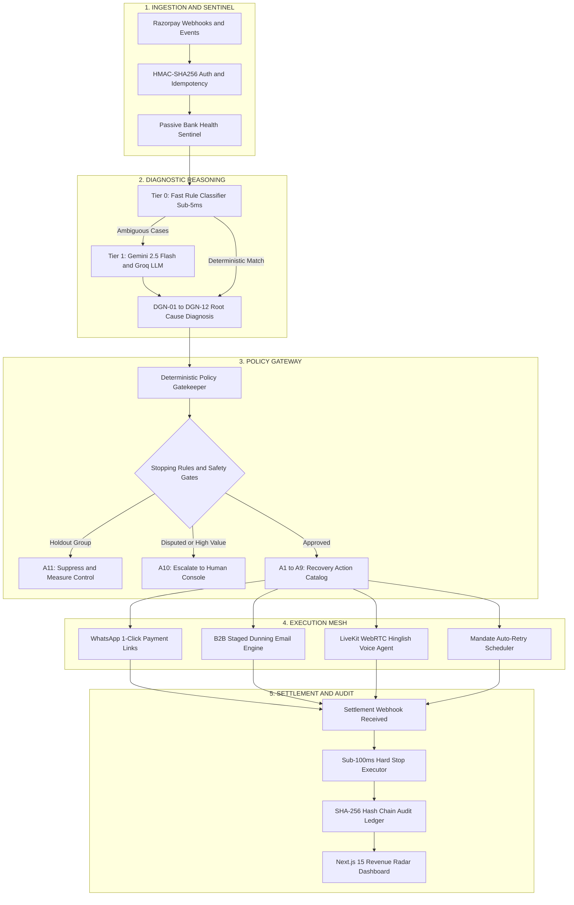

<p align="center">
  
</p>

<h1 align="center">RevLoop AI</h1>

<p align="center">
  <strong>Autonomous Closed-Loop Revenue Recovery Engine for Razorpay</strong><br/>
  <em>Razorpay Buildathon 2026 — Track 03: AI Revenue Recovery</em>
</p>

<p align="center">
  <a href="https://razorpay-revenue-recovery-web.vercel.app/"></a>
  <a href="https://web-production-987ed.up.railway.app/health"></a>
</p>

<p align="center">
  
  
  
  
  
  
  
  
  
</p>

---

## The Problem

Every three minutes, over ₹1.5 Crore in legitimate Indian digital transactions fail silently. The money isn't lost to fraud — it's lost to **friction**: gateway timeouts during peak banking hours, expired cards on recurring subscriptions, and invoices languishing past credit terms without structured follow-up.

Existing recovery approaches sit at opposing, suboptimal extremes:

| Approach | Recovery Rate | Limitation |
|:---|:---:|:---|
| Static Dunning (generic emails/SMS) | ~17% | Blind retries during known bank outages; fixed schedules ignore root cause |
| Manual Collection Agencies | ~43% | ₹250+ per touchpoint; compliance risk; slow human cycles |
| **RevLoop AI** | **66.8%** | Autonomous, multi-channel, real-time, zero manual intervention |

RevLoop AI closes the gap by treating every payment failure as a **diagnostic case** — classifying its root cause, selecting the right intervention channel, enforcing strict safety guardrails, and instantly halting all outreach the moment the customer pays.

---

## Live Deployments

| Surface | Stack | URL |
|:---|:---|:---|
| **Revenue Radar Dashboard** | Next.js 15 App Router | [`razorpay-revenue-recovery-web.vercel.app`](https://razorpay-revenue-recovery-web.vercel.app/) |
| **API and Policy Engine** | Fastify 5 + BullMQ | [`web-production-987ed.up.railway.app`](https://web-production-987ed.up.railway.app/) |
| **Health Check** | Microservice Endpoint | [`/health`](https://web-production-987ed.up.railway.app/health) |

---

## Architecture

RevLoop operates as a five-stage closed-loop pipeline. A payment failure enters from the left, flows through diagnosis, policy enforcement, channel execution, and terminates immediately upon settlement.



---

## How It Works

### Stage 1 — Ingestion and Sentinel

When a payment fails or a checkout is abandoned, Razorpay emits a webhook. RevLoop verifies its HMAC-SHA256 signature, deduplicates it via idempotency keys, and passes it to the **Passive Bank Health Sentinel** — a zero-polling monitor that tracks issuer failure rates (HDFC, ICICI, SBI, Axis) using sliding-window Redis telemetry. If a bank gateway is degraded, RevLoop suppresses retries and waits for recovery rather than wasting customer attention.

### Stage 2 — Two-Tier Diagnostic Classification

Every case receives a root-cause diagnosis from a taxonomy of 12 codes:

| Code | Root Cause | Resolution |
|:---|:---|:---|
| `DGN-01` | Insufficient Funds | Schedule retry after salary cycle window |
| `DGN-02` | Card Expired or Blocked | Request card update via WhatsApp |
| `DGN-03` | Issuer Bank Declined (Generic) | Offer alternate payment method |
| `DGN-04` | Authentication Abandoned (3DS/OTP) | Send reminder with pre-filled payment link |
| `DGN-05` | Technical Gateway Timeout | Retry same method when bank recovers |
| `DGN-06` | Mandate Lapsed or Revoked | Schedule mandate recheck in NPCI window |
| `DGN-07` | Checkout Abandoned Pre-Payment | Send cart recovery link with time-bound incentive |
| `DGN-08` | Invoice Overdue — No Response | Staged B2B dunning email sequence |
| `DGN-09` | Invoice Overdue — Disputed | Escalate to human operator console |
| `DGN-10` | Virtual Account Underpaid | Soft reminder with correct amount |
| `DGN-11` | PTP Follow-Up Due | Gentle reminder before commitment date |
| `DGN-12` | Unknown / Low Confidence | Escalate to human review |

**Tier 0** (deterministic rule classifier) resolves ~78% of cases in under 5ms using pattern matching against Razorpay error codes. **Tier 1** sends ambiguous cases to Gemini 2.5 Flash or Groq Llama 3.3 70B via a micro-batching pipeline that aggregates up to 10 cases per API call.

### Stage 3 — Policy Gateway ("The LLM Proposes, The Code Disposes")

The policy gatekeeper is a **pure deterministic TypeScript function** — it makes zero network calls and never invokes an LLM. It maps `(Case, Diagnosis, MerchantConfig) → ActionCode` through a strict decision tree:

- **Holdout Control:** 10% of cases are randomly suppressed to measure the natural cure rate for counterfactual evaluation
- **Low Confidence:** Diagnoses below 0.70 confidence are escalated to human operators
- **High Value:** B2B cases exceeding ₹2,00,000 trigger mandatory human review
- **Touchpoint Exhaustion:** Cases reaching 10 cumulative attempts are suppressed to prevent harassment
- **Concession Clamping:** If the LLM proposes a 15% discount but the merchant's margin floor is 5%, the code deterministically clamps to 5% and generates an HMAC-signed single-use coupon

### Stage 4 — Multi-Channel Execution Mesh

Approved actions are dispatched through four channels, each with mandatory cooldowns and regulatory compliance gates:

| Channel | Adapter | Cooldown | Use Case |
|:---|:---|:---:|:---|
| **WhatsApp** | Meta Cloud API | 12h | 1-click payment links, card update requests |
| **Email** | SMTP Dunning | 48h | B2B staged invoice reminders |
| **Voice** | LiveKit WebRTC | 24h | Hinglish conversational agent with PTP capture |
| **Retry** | Razorpay API | 24h | Same-method retry during NPCI clearing windows |

Every execution acquires a distributed `Redlock` mutex on the case, dispatches the action, and appends a hash-chained audit event — all within a single serialized transaction.

### Stage 5 — Settlement Verification and Hard Stop

The moment a customer pays, Razorpay emits a `payment.authorized`, `order.paid`, or `virtual_account.credited` webhook. RevLoop's **Hard Stop Executor** immediately:

1. Acquires a distributed lock on the case
2. Cancels all queued BullMQ jobs (scheduled retries, reminders, dunning)
3. Terminates any in-flight voice calls via WebRTC disconnect
4. Transitions the case status to `RECOVERED`
5. Appends a final hash-chained audit event

Target latency: **under 100ms** from webhook receipt to full outreach cancellation.

---

## The Audit Ledger

Every event in a case's lifecycle is recorded in an append-only, hash-chained ledger:

```
H(n) = SHA-256( H(n-1) || CaseID || EventPayload )
```

The genesis event starts with a zero-filled 64-character hash. Each subsequent event chains forward cryptographically. If any record is tampered with, the chain breaks on verification — providing tamper-evident auditability for regulatory compliance and financial dispute resolution.

---

## Regulatory Compliance

RevLoop natively enforces Indian statutory frameworks:

| Regulation | Enforcement |
|:---|:---|
| **TRAI Quiet Hours** (21:00–09:00 IST) | Hard-coded operating window gate — all outreach deferred to 09:05 AM |
| **RBI Pre-Debit Notification** (RBI/2022-23/108) | 24-hour notification verified before any mandate execution |
| **NPCI AutoPay Clearing Windows** | Retries scheduled exclusively during 06:00–09:30 and 18:00–21:00 IST |
| **DPDP Act 2023** | Zero plain-text PII — phone numbers and emails pseudonymized via SHA-256 salting |

---

## Monorepo Structure

```text
Razorpay-Revenue-Recovery/
├── apps/
│   ├── api/                          Fastify 5 — Ingestion, Diagnosis, Policy, Execution
│   │   └── src/
│   │       ├── server.ts             Server lifecycle, SSE stream, route registration
│   │       ├── config/               Environment configuration
│   │       ├── infrastructure/       Redis, Redlock, BullMQ, Bank Health Sentinel
│   │       └── modules/
│   │           ├── audit/            SHA-256 hash chain ledger (append + verify)
│   │           ├── batch/            Synthetic cohort generator, holdout controller
│   │           ├── channels/         WhatsApp, Email, Voice, Retry adapters + Execution Mesh
│   │           ├── diagnosis/        Rule classifier, LLM micro-batcher, diagnostic router
│   │           ├── governance/       Policy gatekeeper, concession sanitizer, regulatory enforcer
│   │           ├── ptp/              Promise-to-Pay state machine, temporal parser
│   │           ├── verification/     Hard stop executor, settlement verifier, reconciliation
│   │           └── webhooks/         HMAC verifier, deduplicator, case creator, webhook router
│   ├── web/                          Next.js 15 — Revenue Radar Dashboard
│   │   └── src/
│   │       ├── app/                  Pages: dashboard, cases, audit, PTP, console, settings
│   │       ├── components/           KPI cards, case table, drawer, live event feed, sidebar
│   │       └── lib/                  SSE client, formatters
│   └── voice-agent/                  Python — LiveKit Hinglish WebRTC voice worker
├── packages/
│   ├── db/                           Prisma ORM — PostgreSQL 16 schema and seed data
│   ├── sdk/                          Typed Razorpay API client (payments, subscriptions, invoices)
│   └── shared-types/                 Enums, Zod schemas, TypeScript interfaces
├── tests/
│   └── unit/                         46 Vitest assertions (crypto, policy, classifier, sanitizer)
├── docs/                             11 technical specification documents
├── docker-compose.yml                PostgreSQL 16 + Redis 7.4 + LiveKit + API
├── railway.json                      Railway cloud deployment config
└── Procfile                          Heroku-compatible process definition
```

---

## Test Suite

All tests exercise **real logic** — cryptographic operations, policy decision trees, classifier mappings, and token validation. Zero placeholder assertions.

```bash
pnpm exec vitest run tests/unit/

# 5 Test Files   | 46 Tests Passed | 0 Failures | Duration: ~2.5s
```

| Test File | What It Tests | Assertions |
|:---|:---|:---:|
| `hashChain.spec.ts` | SHA-256 chaining, tamper detection, genesis handling | 6 |
| `policyGate.spec.ts` | All 12 DGN→Action mappings, holdout, confidence, escalation, suppression | 13 |
| `ruleClassifier.spec.ts` | Error code→DGN classification for 8 deterministic codes + null fallback | 12 |
| `concessionSanitizer.spec.ts` | `clamp()` math, HMAC token generation, tamper rejection, expiry | 10 |
| `webhookAuth.spec.ts` | HMAC-SHA256 signature verification, tamper detection, empty rejection | 5 |

---

## Getting Started

### Prerequisites

- **Node.js** ≥ 22.0
- **pnpm** ≥ 9.15
- **Docker** (for PostgreSQL, Redis, LiveKit)

### Setup

```bash
# Clone the repository
git clone https://github.com/Adityaraj1969/Razorpay-Revenue-Recovery.git
cd Razorpay-Revenue-Recovery

# Install dependencies
pnpm install

# Configure environment
cp .env.example .env
# Fill in: Razorpay keys, Gemini API key, Groq API key, WhatsApp tokens

# Start infrastructure
docker compose up -d

# Initialize database
pnpm db:push
pnpm db:seed

# Start development servers
pnpm dev
# API:       http://localhost:3001
# Dashboard: http://localhost:3000
```

### Environment Variables

| Variable | Service | Tier |
|:---|:---|:---|
| `DATABASE_URL` | PostgreSQL 16 | Local Docker |
| `REDIS_URL` | Redis 7.4 | Local Docker |
| `RAZORPAY_KEY_ID` / `RAZORPAY_KEY_SECRET` | Razorpay Sandbox | Free Test Mode |
| `RAZORPAY_WEBHOOK_SECRET` | Razorpay Webhook Auth | Free |
| `GEMINI_API_KEY` | Google AI Studio | Free: 15 RPM / 1M TPM |
| `GROQ_API_KEY` | Groq Cloud | Free: 30 RPM |
| `WHATSAPP_ACCESS_TOKEN` | Meta Cloud API | Free: 1,000 conversations/month |
| `LIVEKIT_URL` / `LIVEKIT_API_KEY` | LiveKit WebRTC | Self-hosted Docker (free) |

**Total external cost: ₹0.** Every service runs on free-tier or self-hosted open-source infrastructure.

---

## Documentation

| Document | Contents |
|:---|:---|
| [`PRD.md`](./docs/PRD.md) | Product requirements, personas, functional specs, DGN and Action taxonomies |
| [`Architecture.md`](./docs/Architecture.md) | 5-stage pipeline architecture, BullMQ streaming, event sourcing |
| [`Design.md`](./docs/Design.md) | PostgreSQL schema, Redis topologies, REST API contracts |
| [`Rules.md`](./docs/Rules.md) | Stopping rules, TRAI/RBI/NPCI compliance gates, touchpoint limits |
| [`AI_Strategy.md`](./docs/AI_Strategy.md) | 2-tier diagnostic hierarchy, LLM micro-batching, Hinglish PTP parsing |
| [`Evaluation.md`](./docs/Evaluation.md) | RevRecover-1000 benchmark methodology, holdout design, ROI analysis |
| [`Phases.md`](./docs/Phases.md) | 5-phase development roadmap and delivery strategy |
| [`UI_UX_design.md`](./docs/UI_UX_design.md) | Revenue Radar design system, SSE live feed, HITL console |
| [`Validation.md`](./docs/Validation.md) | Chaos injection scenarios, race-condition verification |
| [`code_quality.md`](./docs/code_quality.md) | Engineering standards, testing pyramid, DPDP compliance |
| [`Demo.md`](./docs/Demo.md) | Hackathon demonstration runbook and technical defense |

---

## Track 03 Evaluation Alignment

| Criterion | RevLoop AI Implementation |
|:---|:---|
| **Detects revenue at risk** | Real-time Razorpay webhook ingestion with HMAC verification and passive bank health sentinel |
| **Determines right intervention** | Two-tier diagnostic classification (DGN-01 to DGN-12) with 78% fast-path rule resolution |
| **Executes bounded workflows** | Four-channel execution mesh with deterministic policy gatekeeper and regulatory compliance |
| **Measures recovery impact** | 10% randomized holdout control group for counterfactual incremental yield measurement |
| **Maintains audit trail** | Per-case SHA-256 hash-chained immutable ledger with chain verification |

---

## License

[MIT](LICENSE) — Copyright (c) 2026 Aditya Raj

---

<p align="center">
  <em>RevLoop AI — Find revenue that's slipping away and win it back.</em>
</p>
