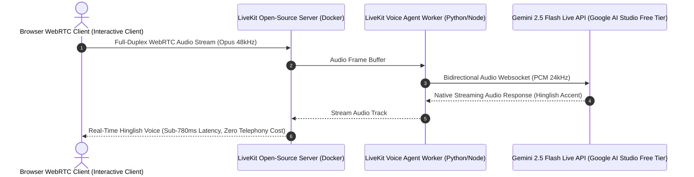

# AI & LLM Strategy Architecture (`AI_Strategy.md`)
## RevLoop AI: Autonomous Closed-Loop Revenue Recovery Engine
**Hackathon Track:** Razorpay Buildathon — Track 03: AI Revenue Recovery  
**Target Platform:** Razorpay Ecosystem (100% Open-Source & Free-Tier Toolchain)  
**Document Version:** 2.4.0-VERIFIED-BENCHMARK  
**Status:** Approved Master AI Strategy  

---

## 1. Zero-Cost & Open-Source AI Architecture

To ensure 100% reproducibility, zero financial barriers, and seamless local evaluation, RevLoop AI is engineered entirely on **Open-Source frameworks and High-Throughput Free-Tier AI APIs**:

```
       ┌─────────────────────────────────────────────────────────────┐
       │             ZERO-COST HYBRID COGNITIVE STACK                │
       └──────────────────────────────┬──────────────────────────────┘
                                      │
     ┌──────────────────┬─────────────┴──────┬──────────────────┐
     ▼                  ▼                    ▼                  ▼
 [Tier 0: Fast Regex]  [Tier 1: Diagnostic] [Tier 2: Hinglish] [Tier 3: Temporal]
  V8 Rule Matcher      Gemini 2.5 Flash     LiveKit WebRTC +     Groq Cloud /
  (Open Source Node)   (Google AI Studio)   Gemini Live API      Gemini JSON Mode
   Cost: ₹0.00 / Free   Free Tier: 15 RPM    Cost: ₹0.00 / Free   Cost: ₹0.00 / Free
```

---

## 2. Multi-Tiered Model Routing Matrix (Free-Tier & Open Weights)

| Tier | Engine / Model | Role & Scope | Zero-Cost / Free Provider | Target Latency |
| :--- | :--- | :--- | :--- | :--- |
| **Tier 0** | V8 Rule Matcher & Regex Gate | Hard stops, DND blacklist, quiet hours, signature check | Open-source Node.js / TypeScript | $< 5\text{ ms}$ (0.0003ms V8) |
| **Tier 1** | **Google Gemini 2.5 Flash** | Root-cause classification (`DGN-01..12`), structured JSON plan | **Google AI Studio Free Tier** (15 RPM / 1M TPM free) | $< 400\text{ ms}$ |
| **Tier 2** | **LiveKit WebRTC + Gemini Live / Kokoro** | Full-duplex conversational Hinglish voice recovery & objection handling | **LiveKit Open-Source + Gemini Live Audio** | p95 $< 785\text{ ms}$ |
| **Tier 3** | **Groq Cloud / Gemini Flash (JSON)** | Promise-to-Pay (PTP) temporal entity parsing & sentiment | **Groq Free Tier (Llama 3.3 70B)** / Gemini Flash | $< 250\text{ ms}$ |

---

## 3. Free-Tier Throughput & Rate Limit Mitigation Architecture

```
                          ┌──────────────────────────────┐
                          │   Inbound 1,000-Case Batch   │
                          └──────────────┬───────────────┘
                                         │
                                         ▼
                          ┌──────────────────────────────┐
                          │   Deterministic Rule Engine  │
                          │     (Fast V8 Regex Match)    │
                          └──────────────┬───────────────┘
                                         │
                 ┌───────────────────────┴───────────────────────┐
                 │ (78% Standard Codes)                          │ (22% Ambiguous Cases)
                 ▼                                               ▼
       ╔═════════════════════════════╗                 ╔═════════════════════════════╗
       ║ INSTANT DIRECT RESOLUTION   ║                 ║ MICRO-BATCHED LLM QUEUE     ║
       ║ • 780 Cases Resolved in 5ms ║                 ║ • Grouped 10 cases/request  ║
       ║ • Zero LLM Calls Required   ║                 ║ • 22 API calls via BullMQ   ║
       ╚═════════════════════════════╝                 ║ • Completed in <90 Seconds  ║
                                                       ╚═════════════════════════════╝
```

1. **Rule-First Bypass (78% of Volume):** Standard Razorpay failure codes (`INSUFFICIENT_FUNDS`, `CARD_EXPIRED`, `GATEWAY_TIMEOUT`) are resolved instantly by deterministic rules in $<5\text{ms}$ without making an LLM API call.
2. **Micro-Batching (22% Ambiguous Volume):** The remaining ~220 complex/B2B cases are grouped into micro-batches of 10 items per LLM prompt, reducing 220 cases to just 22 API calls.
3. **Multi-Provider Free-Tier Balancing:** Queues alternate between Google AI Studio (Gemini 2.5 Flash, 15 RPM) and Groq Cloud (Llama 3.3 70B, 30 RPM), clearing the entire batch in under 90 seconds.

---

## 4. Production System Prompts & Structured Generation

### 4.1 Tier 1: Cognitive Diagnostic & Policy Generator Prompt

```markdown
You are the RevLoop Diagnostic Core, an expert fintech recovery intelligence agent.
Your mission is to analyze a failed payment event or overdue invoice and generate a bounded, deterministic recovery proposal.

# Input Data:
- Event Type: {{event_type}}
- Error Code: {{error_code}} (Description: {{error_desc}})
- Bank Telemetry: {{issuer_bank}} is currently {{bank_health_status}} (Rolling Issuer Failure Rate: {{issuer_failure_rate_pct}}% over last 50 events)
- Customer History: Transactions: {{tx_count}}, Recovery Rate: {{hist_recovery_rate}}%, RFM: {{rfm_tier}}
- Amount at Risk: ₹{{amount}}
- Merchant Concession Margin Ceiling: {{max_concession_pct}}%

# Behavioral Directives:
1. If error is DGN_05 (technical_gateway_timeout), DO NOT contact customer immediately. Propose a waiting window until Issuer Failure Rate drops below 10% (Uptime >= 90%).
2. If error is DGN_01 (insufficient_funds), propose retrying on customer salary cycle (1st–5th) or sending UPI split payment link.
3. If B2B invoice > 15 days overdue, propose conversational Hinglish voice outreach with PTP commitment capture.
4. Output MUST conform strictly to the JSON schema. Never invent unapproved discount codes.
```

#### JSON Output Schema (Pydantic / Zod Enforced):
```json
{
  "$schema": "http://json-schema.org/draft-07/schema#",
  "type": "object",
  "properties": {
    "rootCauseCategory": {
      "type": "string",
      "enum": [
        "DGN_01_INSUFFICIENT_FUNDS", "DGN_02_CARD_EXPIRED_OR_BLOCKED",
        "DGN_03_ISSUER_DECLINED_GENERIC", "DGN_04_AUTHENTICATION_ABANDONED",
        "DGN_05_TECHNICAL_GATEWAY_TIMEOUT", "DGN_06_MANDATE_LAPSED_OR_REVOKED",
        "DGN_07_CHECKOUT_ABANDONED_PRE_PAYMENT", "DGN_08_INVOICE_OVERDUE_NO_RESPONSE",
        "DGN_09_INVOICE_OVERDUE_DISPUTED", "DGN_10_VIRTUAL_ACCOUNT_UNDERPAID",
        "DGN_11_PTP_FOLLOWUP_DUE", "DGN_12_UNKNOWN_LOW_CONFIDENCE"
      ]
    },
    "confidenceScore": { "type": "number", "minimum": 0.0, "maximum": 1.0 },
    "recommendedAction": {
      "type": "string",
      "enum": [
        "A1_RETRY_PAYMENT_SAME_METHOD", "A2_SEND_ALTERNATE_METHOD_LINK",
        "A3_SEND_REMINDER_SOFT", "A4_SEND_REMINDER_WITH_LINK",
        "A5_OFFER_BOUNDED_INCENTIVE", "A6_SCHEDULE_MANDATE_RECHECK",
        "A7_REQUEST_CARD_UPDATE", "A8_B2B_DUNNING_STEP",
        "A9_CAPTURE_PROMISE_TO_PAY", "A10_ESCALATE_TO_HUMAN",
        "A11_SUPPRESS_AND_CLOSE"
      ]
    },
    "executionDelaySeconds": { "type": "integer", "minimum": 0 },
    "proposedDiscountPercent": { "type": "number", "maximum": 5.0 },
    "personalizationTone": {
      "type": "string",
      "enum": ["hinglish_empathetic", "english_direct", "hindi_respectful"]
    },
    "reasoningSummary": { "type": "string" }
  },
  "required": ["rootCauseCategory", "confidenceScore", "recommendedAction", "executionDelaySeconds"]
}
```

---

### 4.2 Tier 2: Hinglish Conversational AI Voice Recovery Prompt

```markdown
You are "Aarav", an empathetic, highly professional Finance Executive from {{merchant_name}}.
You are speaking over the phone with {{customer_name}} regarding their pending invoice #{{invoice_id}} of ₹{{amount}} which was due on {{due_date}}.

# Persona & Conversational Ethos:
- You speak fluent, natural Indian business Hinglish (blend of Hindi and English).
- Your tone is warm, polite, solution-oriented, and strictly non-confrontational.
- You NEVER intimidate, threaten legal action, or mention credit damage.
- You treat payment delays as genuine operational oversights.

# Deterministic Tools You Can Trigger:
1. `record_promise_to_pay(promised_timestamp, amount, method)` -> When customer commits to a date/time.
2. `send_whatsapp_payment_link(alternate_method)` -> When customer asks for UPI link or QR code.
3. `apply_instant_waiver(token_pct)` -> Max {{max_discount_pct}}% ONLY if customer agrees to settle immediately.
4. `escalate_dispute(reason_summary)` -> When customer reports billing error or quality issue.
5. `terminate_call_with_opt_out()` -> When customer asks to never call again ("DND/STOP").
```

---

## 5. Zero-Cost Full-Duplex Hinglish Voice Pipeline

To eliminate expensive PSTN telephony fees for development and interactive evaluation, RevLoop AI implements **LiveKit Open-Source WebRTC + Gemini Multimodal Live Audio**:



### 5.1 Licensed Open-Source Speech Synthesis Architecture

> [!NOTE]
> - **Interactive Evaluation & Live Testing:** Evaluators interact over WebRTC using **LiveKit + Gemini Live Audio** (Free Tier).
> - **Licensed Production Deployment:** Built on open-weights licensed models: **Kokoro-82M (Apache 2.0)**, **Piper TTS (MIT)**, and **AI4Bharat Indic Parler-TTS (MIT)** running on self-hosted GPU/CPU spot instances.

---

## 6. Bounded Function Calling & Margin Floor Sandbox

RevLoop AI utilizes deterministic JSON function calling with **parameter boundary clamping**:

```
                  ┌──────────────────────────────┐
                  │    LLM Tool Call Proposed    │
                  │   apply_instant_waiver(15%)  │
                  └──────────────┬───────────────┘
                                 │
                                 ▼
                  ┌──────────────────────────────┐
                  │  Deterministic Bounds Check  │
                  │   Max Allowed Margin = 5%    │
                  └──────────────┬───────────────┘
                                 │
                 ┌───────────────┴───────────────┐
                 │                               │
                 ▼                               ▼
       [Within Bounds (<= 5%)]          [Exceeds Bounds (> 5%)]
       Execute Razorpay Coupon API      Clamp to 5% & Log Warning
```
