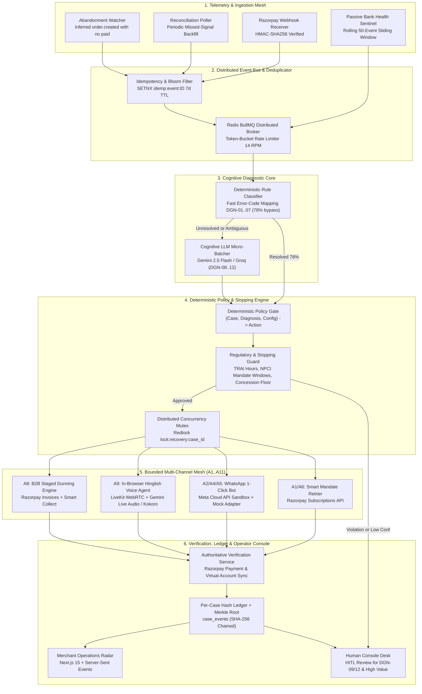
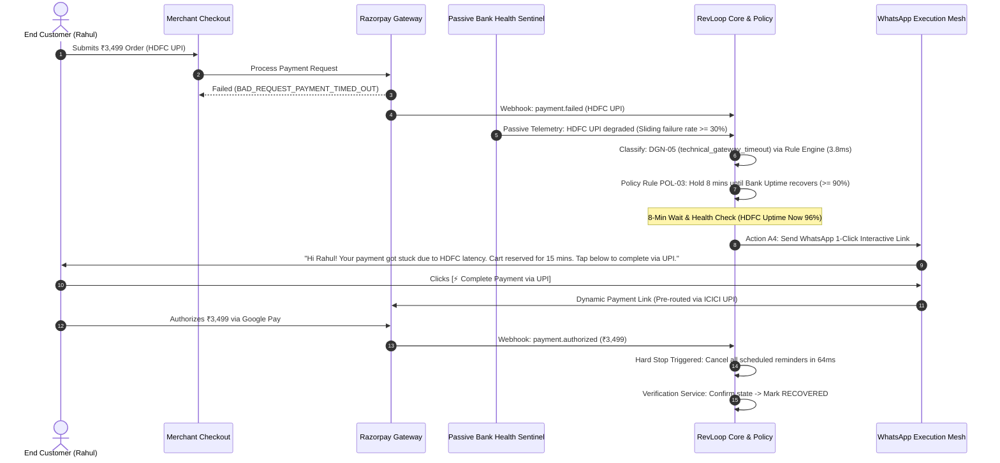
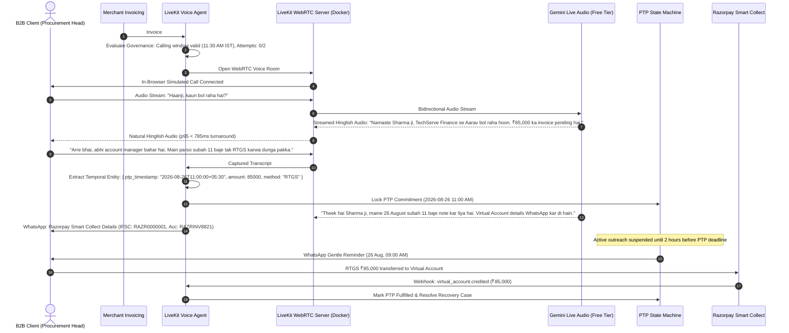

# System Architecture & Technical Design
## RevLoop AI: Autonomous Closed-Loop Revenue Recovery Engine
**Hackathon Track:** Razorpay Buildathon — Track 03: AI Revenue Recovery  
**Target Platform:** Razorpay Ecosystem (100% Open-Source & Free-Tier Toolchain)  
**Document Version:** 2.4.0-VERIFIED-BENCHMARK  
**Status:** Approved Master Architecture  

---

## 1. Architectural Design Invariants

RevLoop AI is built around four non-negotiable architectural invariants:

1. **"The LLM Proposes, The Code Disposes"**: Language models (Gemini 2.5 Flash / Groq Llama 3.3) read telemetry, classify unstructured text, and draft conversational messages. They are *never* the component that authorizes an action. Every action must pass through a pure, deterministic, unit-tested policy engine that never invokes an LLM.
2. **Event-Sourced Case Projections with Per-Case Hash Chaining**: Case state is not a mutable column in a database. Case state is a read-only projection computed over an append-only, immutable, per-case SHA-256 hash-chained log (`case_events`).
3. **Closed-Loop Razorpay Verification**: A case is marked `RECOVERED` only when verified against authoritative Razorpay payment and settlement webhooks — never on the basis of a sent message or a verbal promise.
4. **Counterfactual Batch Measurement**: The architecture includes a native **Randomized Holdout Controller (10%)** that isolates the agent's incremental recovery yield from natural self-curing transactions.

---

## 2. End-to-End System Architecture Diagram



---

## 3. Ten-Layer System Component Breakdown

| # | System Layer | Primary Responsibility | Zero-Cost / Open-Source Tool |
| :--- | :--- | :--- | :--- |
| **1** | **Ingestion Gateway** | Ingests authentic webhooks (`payment.failed`, `order.paid`, `invoice.expired`). | Fastify / Node.js 22 (Open Source) |
| **2** | **Passive Bank Health Sentinel** | Computes sliding 50-event failure rate over incoming `payment.failed` webhooks. | In-Memory Redis 7.4 Ring Buffer (Zero Polling) |
| **3** | **Event Deduplicator** | Redis Bloom filter + atomic `SETNX` mutex. | Redis 7.4 / BullMQ |
| **4** | **Diagnostic Core** | Classifies failure root cause (`DGN-01` to `DGN-12`) via rule bypass + LLM micro-batching. | V8 Matcher + Gemini 2.5 Flash / Groq Llama 3.3 |
| **5** | **Policy Gatekeeper** | Pure function mapping $(Case, Diagnosis) \rightarrow Action$ (`A1`..`A11`). | Pure TypeScript (Zero Network Calls) |
| **6** | **Governance Guard** | Enforces TRAI hours, NPCI non-peak windows, and stopping triggers. | Deterministic State Evaluator |
| **7** | **Execution Adapters** | Dispatches WhatsApp, Voice, Email, or Mandate Retries. | Meta Cloud Sandbox + Mock WhatsApp Adapter |
| **8** | **Voice Audio Bridge** | Full-duplex WebRTC browser-to-agent conversational bridge. | **LiveKit Open-Source Server + Gemini Live Audio** |
| **9** | **Verification Service** | Reconciles recovery against Razorpay payment entities. | Razorpay REST API (Test Sandbox) |
| **10** | **Per-Case Audit Ledger** | Append-only `case_events` with per-case SHA-256 chaining. | PostgreSQL 16 (Local Docker / Neon Free) |

---

## 4. Passive Bank Health Sentinel: Zero-Polling Architecture

To comply strictly with NPCI and payment gateway access policies (which prohibit third-party status polling), the **Bank Health Sentinel** operates purely on **self-observed passive event telemetry**:
1. **Rolling Ingestion Window Aggregation**: A sliding 50-event in-memory Redis ring buffer analyzes incoming `payment.failed` webhooks containing `error.source = 'issuer_bank'` and standard error codes (`BAD_REQUEST_PAYMENT_TIMED_OUT`, `BANK_SYSTEM_ERROR`, `GATEWAY_ERROR`).
2. **Degradation Detection**: If the failure rate for a specific issuer bank (e.g., HDFC UPI) reaches $\ge 30.0\%$ over 50 consecutive transactions, the local sentinel marks that issuer route as `DEGRADED` with zero external polling.
3. **Automatic Retry Deferral**: When an issuer is degraded, mandate retries and checkout links are temporarily deferred until the rolling success rate recovers to $\ge 90.0\%$.

---

## 5. Free-Tier Rate Limit & Batch Ingestion Mitigation

```
                          ┌──────────────────────────────┐
                          │   Inbound 1,000-Case Batch   │
                          └──────────────┬───────────────┘
                                         │
                                         ▼
                          ┌──────────────────────────────┐
                          │   Deterministic Rule Engine  │
                          │     (Fast V8 Regex Match)    │
                          └──────────────┬───────────────┘
                                         │
                 ┌───────────────────────┴───────────────────────┐
                 │ (78% Standard Codes)                          │ (22% Ambiguous Cases)
                 ▼                                               ▼
       ╔═════════════════════════════╗                 ╔═════════════════════════════╗
       ║ INSTANT DIRECT RESOLUTION   ║                 ║ MICRO-BATCHED LLM QUEUE     ║
       ║ • 780 Cases Resolved in 5ms ║                 ║ • Grouped 10 cases/request  ║
       ║ • Zero LLM Calls Required   ║                 ║ • 22 API calls via BullMQ   ║
       ╚═════════════════════════════╝                 ║ • Completed in <90 Seconds  ║
                                                       ╚═════════════════════════════╝
```

1. **Rule-First Bypass (78% of Volume):** Standard Razorpay failure codes (`INSUFFICIENT_FUNDS`, `CARD_EXPIRED`, `GATEWAY_TIMEOUT`) are resolved instantly by deterministic rules in $<5\text{ms}$ without making an LLM API call.
2. **Micro-Batching (22% Ambiguous Volume):** The remaining ~220 complex/B2B cases are grouped into micro-batches of 10 items per LLM prompt, reducing 220 cases to just 22 API calls.
3. **Multi-Provider Free-Tier Balancing:** Queues alternate between Google AI Studio (Gemini 2.5 Flash, 15 RPM) and Groq Cloud (Llama 3.3 70B, 30 RPM), clearing the entire batch in under 90 seconds.

---

## 6. Event-Sourced Data Model & Per-Case Cryptographic Ledger

$$\text{RecordHash}_{c, k} = \text{SHA256}\left(\text{CaseID} + \text{Payload}_{c, k} + \text{RecordHash}_{c, k-1}\right)$$

Because distributed workers acquire a distributed `Redlock(case_id)` before mutating case state, writes to any individual case are strictly sequential. Concurrently processed cases append to the log in parallel without blocking each other.

```
 Case A Pipeline ──[Redlock A]──▶ Event A1 (Hash A1) ──▶ Event A2 (Hash A2) ──┐
                                                                              ├──▶ Hourly Merkle Root
 Case B Pipeline ──[Redlock B]──▶ Event B1 (Hash B1) ──▶ Event B2 (Hash B2) ──┘
```

---

## 7. End-to-End Sequence Workflows

### 7.1 Scenario 1: Bank Degradation & WhatsApp 1-Click Recovery


---

### 7.2 Scenario 2: B2B Receivables In-Browser Voice Chaser with PTP Lock


---

## 8. Distributed Concurrency & Locking Architecture

$$\text{LockKey} = \text{"lock:recovery:case:"} + \text{CaseID}$$

1. **Pre-Execution Lock Acquisition:** Worker acquires an atomic Redis lock with a 30-second lease time before processing any case.
2. **State & Stopping Rule Check:** Queries Postgres projection to ensure `status NOT IN ('RECOVERED', 'SUPPRESSED', 'CLOSED_UNRECOVERED')`.
3. **Execution & Release:** On completion or receipt of settlement webhook, the job updates `case_events` atomically and releases the mutex.
