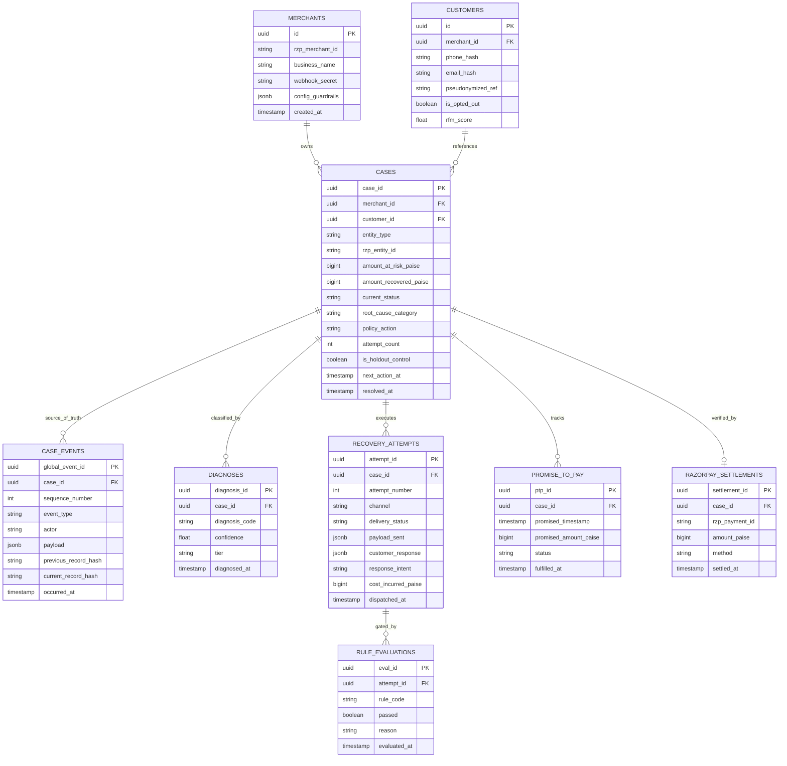
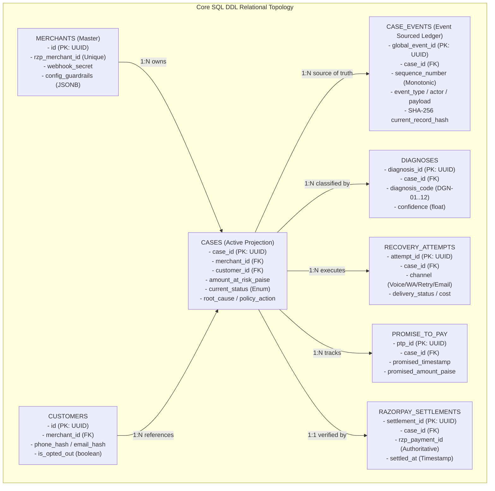

# System, Data & State Design (`Design.md`)
## RevLoop AI: Autonomous Closed-Loop Revenue Recovery Engine
**Hackathon Track:** Razorpay Buildathon — Track 03: AI Revenue Recovery  
**Target Platform:** Razorpay Ecosystem (100% Open-Source & Free-Tier Toolchain)  
**Document Version:** 2.4.0  
**Status:** Approved Master Technical Design  

---

## 1. Domain Model & Relational Entity Schema (PostgreSQL 16)

The database architecture implements an **Event-Sourced Relational Hybrid**: the append-only `case_events` table serves as the immutable single source of truth with per-case hash chaining, while relational tables (`cases`, `diagnoses`, `recovery_attempts`, `promise_to_pay`) provide low-latency projections for querying.



---

## 2. Core SQL DDL & Table Specifications

The following visual relational topology details the primary keys, foreign keys, and 1-to-N relationships across all eight database tables defined in the schema migration below:



```sql
-- Schema Migration: RevLoop AI Core
CREATE EXTENSION IF NOT EXISTS "uuid-ossp";

-- Enum Definitions
CREATE TYPE entity_type_enum AS ENUM ('PAYMENT', 'ORDER', 'SUBSCRIPTION', 'INVOICE', 'VIRTUAL_ACCOUNT');
CREATE TYPE case_status_enum AS ENUM (
    'OPEN', 'DIAGNOSING', 'AWAITING_POLICY', 'ACTION_TAKEN', 
    'PTP_LOCKED', 'COOLDOWN', 'ESCALATED_HUMAN', 'RECOVERED', 
    'SUPPRESSED', 'CLOSED_UNRECOVERED'
);
CREATE TYPE diagnosis_code_enum AS ENUM (
    'DGN_01_INSUFFICIENT_FUNDS', 'DGN_02_CARD_EXPIRED_OR_BLOCKED',
    'DGN_03_ISSUER_DECLINED_GENERIC', 'DGN_04_AUTHENTICATION_ABANDONED',
    'DGN_05_TECHNICAL_GATEWAY_TIMEOUT', 'DGN_06_MANDATE_LAPSED_OR_REVOKED',
    'DGN_07_CHECKOUT_ABANDONED_PRE_PAYMENT', 'DGN_08_INVOICE_OVERDUE_NO_RESPONSE',
    'DGN_09_INVOICE_OVERDUE_DISPUTED', 'DGN_10_VIRTUAL_ACCOUNT_UNDERPAID',
    'DGN_11_PTP_FOLLOWUP_DUE', 'DGN_12_UNKNOWN_LOW_CONFIDENCE'
);
CREATE TYPE action_code_enum AS ENUM (
    'A1_RETRY_PAYMENT_SAME_METHOD', 'A2_SEND_ALTERNATE_METHOD_LINK',
    'A3_SEND_REMINDER_SOFT', 'A4_SEND_REMINDER_WITH_LINK',
    'A5_OFFER_BOUNDED_INCENTIVE', 'A6_SCHEDULE_MANDATE_RECHECK',
    'A7_REQUEST_CARD_UPDATE', 'A8_B2B_DUNNING_STEP',
    'A9_CAPTURE_PROMISE_TO_PAY', 'A10_ESCALATE_TO_HUMAN',
    'A11_SUPPRESS_AND_CLOSE'
);

-- Cases Projection Table
CREATE TABLE cases (
    case_id UUID PRIMARY KEY DEFAULT uuid_generate_v4(),
    merchant_id UUID NOT NULL,
    customer_id UUID NOT NULL,
    entity_type entity_type_enum NOT NULL,
    rzp_entity_id VARCHAR(128) NOT NULL,
    amount_at_risk_paise BIGINT NOT NULL,
    amount_recovered_paise BIGINT DEFAULT 0,
    current_status case_status_enum NOT NULL DEFAULT 'OPEN',
    root_cause_category diagnosis_code_enum,
    policy_action action_code_enum,
    attempt_count INT DEFAULT 0,
    voice_attempt_count INT DEFAULT 0,
    whatsapp_attempt_count INT DEFAULT 0,
    is_holdout_control BOOLEAN DEFAULT FALSE,
    next_action_at TIMESTAMPTZ,
    resolved_at TIMESTAMPTZ,
    created_at TIMESTAMPTZ DEFAULT NOW(),
    updated_at TIMESTAMPTZ DEFAULT NOW()
);

-- Unique constraint ensuring exactly one active case per entity
CREATE UNIQUE INDEX idx_uniq_active_case 
ON cases (merchant_id, rzp_entity_id) 
WHERE current_status NOT IN ('RECOVERED', 'SUPPRESSED', 'CLOSED_UNRECOVERED');

-- Immutable Event-Sourced Audit Log with Per-Case Monotonic Sequence
CREATE TABLE case_events (
    global_event_id UUID PRIMARY KEY DEFAULT uuid_generate_v4(),
    case_id UUID NOT NULL REFERENCES cases(case_id) ON DELETE CASCADE,
    sequence_number INT NOT NULL,
    event_type VARCHAR(64) NOT NULL,
    actor VARCHAR(64) NOT NULL,
    payload JSONB NOT NULL,
    previous_record_hash VARCHAR(64) NOT NULL,
    current_record_hash VARCHAR(64) NOT NULL,
    occurred_at TIMESTAMPTZ DEFAULT NOW(),
    CONSTRAINT uniq_case_seq UNIQUE (case_id, sequence_number)
);

CREATE INDEX idx_case_events_case ON case_events(case_id, sequence_number);
CREATE INDEX idx_case_events_time ON case_events(occurred_at DESC);
```

---

## 3. Redis In-Memory State & Mutex Architecture

| Key Pattern | Type | Retention / Window | Purpose |
| :--- | :--- | :--- | :--- |
| `lock:recovery:case:{case_id}` | String | 30s TTL | Distributed Redlock mutex preventing concurrency races per case. |
| `idemp:webhook:{event_id}` | String | 7 Days TTL | Exactly-once webhook deduplication filter. |
| `telemetry:sliding_window:{issuer_code}` | Sorted Set (ZSET) | Last 50 events within 300s window | In-memory ring buffer tracking up to 50 recent transactions with timestamps. Events older than 300s (5 mins) are trimmed via `ZREMRANGEBYSCORE`. Computes rolling issuer failure rate ($\ge 30.0\%$ hold, $\ge 90.0\%$ success resume). |
| `ratelimit:voice:{customer_phone}` | String | 24 Hours TTL | Enforces max 2 voice attempts per 24 hours. |
| `ptp:active_hold:{case_id}` | Hash | Custom PTP TTL | Temporal PTP hold state with trigger callback. |

---

## 4. RESTful API Contracts & Specifications

### 4.1 Webhook Ingestion Endpoint
`POST /api/v1/webhooks/razorpay`

#### Request Headers:
- `X-Razorpay-Signature`: `hmac_sha256_hash`
- `X-Razorpay-Event-Id`: `evt_99182a`

#### Request Body:
```json
{
  "entity": "event",
  "account_id": "acc_live_99812",
  "event": "payment.failed",
  "contains": ["payment"],
  "payload": {
    "payment": {
      "entity": {
        "id": "pay_O0k3J9aN2m1L",
        "amount": 349900,
        "currency": "INR",
        "status": "failed",
        "order_id": "order_K8s9D7f2A1b",
        "method": "upi",
        "error_code": "BAD_REQUEST_PAYMENT_TIMED_OUT",
        "error_description": "Payment was not authorized within the window",
        "error_source": "issuer_bank",
        "error_step": "payment_authentication",
        "error_reason": "bank_technical_degradation",
        "contact": "+919876543210",
        "email": "rahul.verma@example.com"
      }
    }
  },
  "created_at": 1756012800
}
```

#### Response (200 OK):
```json
{
  "status": "acknowledged",
  "case_id": "case_8812a01f-561b-41a2-91ef-0192837465aa",
  "is_holdout": false,
  "diagnosis_code": "DGN_05_TECHNICAL_GATEWAY_TIMEOUT",
  "policy_action": "A4_SEND_REMINDER_WITH_LINK",
  "scheduled_at": "2026-08-24T10:38:00.000Z"
}
```

---

### 4.2 Promise-to-Pay (PTP) Commitment Endpoint
`POST /api/v1/cases/:caseId/ptp`

#### Request Body:
```json
{
  "promised_timestamp": "2026-08-26T11:00:00+05:30",
  "promised_amount_paise": 8500000,
  "promised_method": "RTGS",
  "channel": "LIVEKIT_VOICE_AGENT",
  "transcript_excerpt": "Customer confirmed RTGS payment after account manager returns on 26th."
}
```

#### Response (201 Created):
```json
{
  "status": "PTP_LOCKED",
  "ptp_id": "ptp_77192a",
  "hold_active": true,
  "reminder_scheduled_at": "2026-08-26T09:00:00+05:30",
  "virtual_account_issued": {
    "account_number": "RAZRINV8821",
    "ifsc": "RAZR0000001"
  }
}
```

---

## 5. Razorpay Product & SDK Integration Architecture

```
┌────────────────────────────────────────────────────────────────────────┐
│               RAZORPAY ECOSYSTEM INTEGRATION MATRIX                    │
├────────────────────┬───────────────────────────────────────────────────┤
│ Razorpay Product   │ Specific API & RevLoop AI Capability              │
├────────────────────┼───────────────────────────────────────────────────┤
│ Razorpay Payments  │ Query `fetchPayment`, check failure reason & auth.│
│ Payment Links API  │ Create single-use expiring dynamic payment links. │
│ Subscriptions API  │ Query mandate status & trigger scheduled retries. │
│ Razorpay Invoices  │ Fetch B2B aging invoices, line items, and GST.    │
│ Smart Collect      │ Auto-reconcile B2B RTGS/NEFT to Virtual Accounts. │
│ Razorpay Optimizer │ Route recovered transactions via optimal gateway. │
│ Webhooks Gateway   │ Ingest real-time payment states with HMAC check.  │
└────────────────────┴───────────────────────────────────────────────────┘
```
