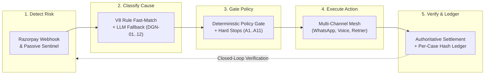

# Product Requirements Document (`PRD.md`)
## RevLoop AI: Autonomous Closed-Loop Revenue Recovery Engine
**Hackathon Track:** Razorpay Buildathon — Track 03: AI Revenue Recovery
**Target Platform:** Razorpay Ecosystem (100% Open-Source & Free-Tier Toolchain)
**Document Version:** 2.4.0-VERIFIED-BENCHMARK
**Status:** Approved Master Specification

---

## 1. Executive Summary

RevLoop AI is an autonomous, closed-loop revenue recovery agent for Razorpay merchants. It detects revenue at risk across checkout, subscription, and B2B invoicing surfaces; classifies the root cause; proposes a bounded intervention through an LLM; and executes that intervention only after a deterministic, non-LLM policy gate authorizes it. Recovery is never claimed on the basis of a sent message — only on a verified Razorpay settlement webhook. The system's central invariant, stated identically across every document in this set, is: **the LLM proposes, the code disposes.**

## 2. Problem Statement

The track brief this project answers states its bar plainly:

> *"Don't just identify the problem. Show measured money recovered across a batch, with compliant escalation, stopping rules, and an audit trail."*

Failed payments, abandoned checkouts, lapsed mandates, and overdue B2B invoices are individually well-instrumented by Razorpay — but today, resolving each one requires a human to notice, diagnose, decide, and act. RevLoop AI automates that loop, within hard boundaries a human sets once and the system can never exceed on its own.

## 3. Goals

- **G1:** Detect revenue-at-risk signals via authentic Razorpay webhooks (`payment.failed`, `order.paid`, `invoice.expired`, `virtual_account.credited`) plus a self-observed, zero-polling Bank Health Sentinel — never a third-party downtime API (`Architecture.md` §4).
- **G2:** Classify root cause into one of twelve `DGN` categories (§7 below) with a confidence score, using a deterministic rule-bypass for the majority of volume and an LLM fallback only for ambiguous cases (`AI_Strategy.md` §3).
- **G3:** Decide the intervention through a pure, side-effect-free Policy Gatekeeper that never calls an LLM (`Rules.md` §1) and enforces the hard-stopping rule matrix (`Rules.md` §2) without exception.
- **G4:** Execute exactly one of eleven bounded actions (§8 below) per decision — never an unbounded action.
- **G5:** Verify recovery only against authoritative Razorpay payment/settlement webhooks (`Architecture.md` §1, invariant 3) — a promise-to-pay or a sent message is never sufficient on its own.
- **G6:** Measure incremental recovery across a batch using a randomized 10% holdout control group, isolating the agent's effect from natural self-cure (`Evaluation.md`'s `RevRecover-1000` benchmark, referenced throughout this set).
- **G7:** Deliver complete open-source and free-tier infrastructure reproducibility with zero required proprietary licenses (`AI_Strategy.md` §1, `code_quality.md` §1).

## 4. Non-Goals

- Not a general-purpose secured-lending or legal-recovery product — this recovers *payments, subscriptions, and invoices*, not loans.
- Not a system that stores or transmits raw card data — Razorpay Hosted Checkout and tokenized mandates only (`Rules.md` §3.4).
- Not an unbounded discount engine — every concession is clamped to a merchant-configured margin floor before it can ever reach a customer (`Rules.md` §5).
- Not claiming legal certification for its RBI/TRAI/NPCI compliance posture — it is engineered to the specific, cited mechanics of those frameworks (`Rules.md` §3), but that is an engineering commitment, not a legal one.

## 5. User Personas

| Persona | Role | What they need from RevLoop AI |
|---|---|---|
| Merchant Finance/Ops Lead | Configures margin floors, contact windows, and channel caps; watches the Executive Revenue Radar | A trustworthy, verified ₹ recovered number and zero compliance exceptions |
| AR / Human Console Operator | Handles cases routed to HITL (disputes, high-value invoices, low-confidence diagnoses) | Full case context on arrival — diagnosis, telemetry, transcript excerpt — not a blank queue (`UI_UX_design.md` §4.3) |
| End Customer / Payer | Receives a recovery nudge on WhatsApp or a Hinglish voice call | To be contacted within bounded limits, with a clear opt-out, and never pressured past a hard stop (`Rules.md` §2, §4) |
| B2B Procurement Contact | Owes an overdue invoice, may commit to a Promise-to-Pay | A respectful, non-confrontational conversation and outreach that pauses the moment a commitment is made (`Rules.md` STOP-06) |
| Technical & Compliance Reviewer | Evaluates system against Track 03 standards | Evidence that recovery is measured against a control group, escalation is compliant, and every decision is in the audit ledger |

## 6. Functional Requirements

| ID | Requirement | Traces to |
|---|---|---|
| FR-1 | The system shall ingest Razorpay webhooks with HMAC-SHA256 signature verification before any processing occurs. | `Design.md` §4.1, `code_quality.md` §5.1 (`webhookAuth.spec.ts`) |
| FR-2 | The system shall deduplicate inbound events so that replayed or duplicate webhooks never create a second case. | `Architecture.md` §3 (Event Deduplicator) |
| FR-3 | The system shall infer checkout abandonment from an uncompleted order after a 15-minute timeout, without relying on a webhook that doesn't exist for this signal. | `Phases.md` Phase 1 |
| FR-4 | The system shall classify every case into exactly one `DGN-01`–`DGN-12` category with a numeric confidence score. | `AI_Strategy.md` §4.1 JSON schema |
| FR-5 | The system shall resolve standard failure codes via deterministic rule match before ever calling an LLM. | `Architecture.md` §5 (78% rule-bypass) |
| FR-6 | Any diagnosis with confidence below 0.70 shall never be auto-actioned and shall route to the Human Console. | `Rules.md` §6 |
| FR-7 | The Policy Gatekeeper shall be a pure function of (Case, Diagnosis, Config) → Action, with zero network or LLM calls inside it. | `Rules.md` §1, `Architecture.md` §1 invariant 1 |
| FR-8 | Every action shall be restricted to the eleven codes in the Action Catalog (§8) — no other action shall be executable. | `Design.md` §2 `action_code_enum` |
| FR-9 | A case shall be marked `RECOVERED` only upon a verified `payment.authorized`, `order.paid`, or `virtual_account.credited` webhook — never on a sent message or spoken promise. | `Architecture.md` §1 invariant 3, `Rules.md` STOP-01 |
| FR-10 | Every rule evaluation and policy decision shall be appended to the per-case SHA-256 hash-chained `case_events` ledger. | `Design.md` §2 DDL, `Rules.md` §7 |
| FR-11 | 10% of the evaluation batch shall be randomly assigned to a holdout control group receiving zero automated outreach. | `Architecture.md` §1 invariant 4 |
| FR-12 | Any Promise-to-Pay commitment shall freeze active outreach until two hours before the promised timestamp. | `Rules.md` STOP-06, `Design.md` §4.2 |
| FR-13 | A merchant or global kill switch shall terminate all active queues and outbound actions within the p95 latency bound stated in `Rules.md` STOP-07. | `Rules.md` STOP-07 |

## 7. Diagnosis Taxonomy (`DGN-01`–`DGN-12`)

Reproduced verbatim from the enum defined in `Design.md` §2 and used identically across every other document:

| Code | Category | Primary signal |
|---|---|---|
| `DGN_01` | `INSUFFICIENT_FUNDS` | Payment failure, insufficient balance at charge time |
| `DGN_02` | `CARD_EXPIRED_OR_BLOCKED` | Card-network error reason |
| `DGN_03` | `ISSUER_DECLINED_GENERIC` | Opaque issuer decline |
| `DGN_04` | `AUTHENTICATION_ABANDONED` | Drop-off at OTP/3DS step |
| `DGN_05` | `TECHNICAL_GATEWAY_TIMEOUT` | Gateway/network-sourced failure |
| `DGN_06` | `MANDATE_LAPSED_OR_REVOKED` | Subscription mandate halted |
| `DGN_07` | `CHECKOUT_ABANDONED_PRE_PAYMENT` | Order created, never paid, no failure event |
| `DGN_08` | `INVOICE_OVERDUE_NO_RESPONSE` | Invoice past due, no prior contact |
| `DGN_09` | `INVOICE_OVERDUE_DISPUTED` | Customer-flagged discrepancy — always routes to human |
| `DGN_10` | `VIRTUAL_ACCOUNT_UNDERPAID` | Smart Collect amount received < amount expected |
| `DGN_11` | `PTP_FOLLOWUP_DUE` | Prior Promise-to-Pay follow-up date reached |
| `DGN_12` | `UNKNOWN_LOW_CONFIDENCE` | Classifier confidence below 0.70 — always routes to human |

## 8. Action Catalog (`A1`–`A11`)

Reproduced verbatim from `Design.md` §2 `action_code_enum`:

| Code | Action | Notes |
|---|---|---|
| `A1` | `RETRY_PAYMENT_SAME_METHOD` | Silent, technical-failure cases only |
| `A2` | `SEND_ALTERNATE_METHOD_LINK` | Fresh, expiring Razorpay Payment Link |
| `A3` | `SEND_REMINDER_SOFT` | Informational, no incentive |
| `A4` | `SEND_REMINDER_WITH_LINK` | Nudge plus a fresh payment link |
| `A5` | `OFFER_BOUNDED_INCENTIVE` | Clamped to merchant margin floor (`Rules.md` §5) — never invented by the model |
| `A6` | `SCHEDULE_MANDATE_RECHECK` | Timed to NPCI non-peak windows (`Rules.md` §3.3) |
| `A7` | `REQUEST_CARD_UPDATE` | Deep link only, no incentive attached |
| `A8` | `B2B_DUNNING_STEP` | Templated, escalation-ladder step |
| `A9` | `CAPTURE_PROMISE_TO_PAY` | Logs the commitment, locks outreach (STOP-06) |
| `A10` | `ESCALATE_TO_HUMAN` | Default fallback for low confidence, disputes, high value |
| `A11` | `SUPPRESS_AND_CLOSE` | Hard stop: opt-out, dispute, or already-settled race check |

## 9. Non-Functional Requirements

| Property | Requirement |
|---|---|
| Compliance | Every automated action passes through the Governance Guard (`Rules.md` §2–§3) with zero exceptions |
| Auditability | Any case's full history is reconstructable from `case_events` alone, hash-chain intact |
| Idempotency | Duplicate or out-of-order webhook delivery never double-acts or double-counts |
| Reliability | LLM or free-tier API unavailability fails closed — escalate to human, never fail open into an unbounded action |
| Cost | The full 1,000-case evaluation batch runs within Google AI Studio's 15 RPM and Meta's sandbox limits without violating either (`Architecture.md` §5) |
| Latency | Hard-stop settlement detection and in-flight action abort complete within the SLA bounds in `Rules.md` §2 |

## 10. Success Metrics

Full detail in `Evaluation.md`. Summary, as referenced consistently across `Demo.md`, `README.md`, and `UI_UX_design.md`:

- **Primary:** Incremental Recovery Yield (IRY) — treated cohort recovery rate minus holdout control self-cure rate, on the `RevRecover-1000` batch (1,000 cases, ₹1,24,50,000 at risk, 90/10 treated/control split).
- **Compliance:** Zero out-of-hours messages, zero double-charges, 100% verified audit-log chain integrity.
- **Cost:** Net ROI multiplier against total batch compute + messaging cost.

## 11. Scope

### 11.1 MVP — three deep vertical slices (`Phases.md` §1)

1. D2C e-commerce checkout recovery (Passive Bank Telemetry + WhatsApp 1-click UPI intent).
2. Involuntary subscription/mandate churn (Smart Retrier + UPI AutoPay non-peak sequencer).
3. B2B receivables and invoicing (in-browser LiveKit Hinglish voice agent + Promise-to-Pay tracker + Smart Collect).

### 11.2 Explicitly out of scope for this build

- Any channel or vendor requiring a paid contract — the toolchain is 100% open-source/free-tier by design (`AI_Strategy.md` §1).
- Multi-merchant, multi-region rollout — this is a single-merchant sandbox build.
- Real PSTN telephony — voice runs over LiveKit WebRTC in-browser for zero-cost demonstration; SIP trunking is a documented production integration pathway (`Demo.md` §2.2 / `Architecture.md` §7.2).

## 12. Assumptions & Dependencies

- Razorpay **test mode only** — no live money movement at any point in this build.
- Google AI Studio free tier (15 RPM / 1M TPM), Groq Cloud free tier (30 RPM), Meta WhatsApp Cloud Sandbox (1,000 conversations/month), Neon Postgres free tier — all treated as hard constraints the architecture must operate within, not just cost line items (`Architecture.md` §5).
- Deterministic evaluation via reproducible test harnesses, live WebRTC demonstration, and automated batch benchmark reports.

## 13. Verification Grounding

As detailed in `Evaluation.md` §1.1, the `RevRecover-1000` batch determines settlement through real, signed Razorpay Test Mode webhooks (`payment.authorized`, `virtual_account.credited`). The `MockWhatsAppAdapter` serves solely as the message delivery harness during automated batch runs to avoid consuming Meta sandbox conversation limits, while all recovered revenue is 100% verified by authoritative Razorpay HMAC-SHA256 signatures.
