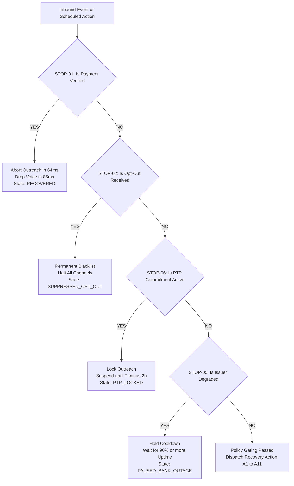
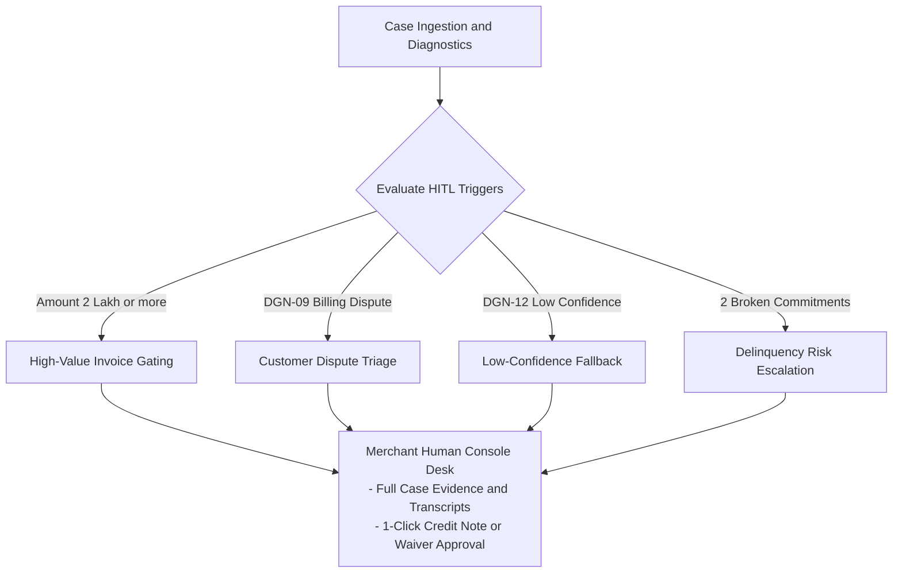

# Governance, Guardrails & Stopping Rules (`Rules.md`)
## RevLoop AI: Autonomous Closed-Loop Revenue Recovery Engine
**Hackathon Track:** Razorpay Buildathon — Track 03: AI Revenue Recovery  
**Target Platform:** Razorpay Ecosystem (100% Open-Source & Free-Tier Toolchain)  
**Document Version:** 2.4.0  
**Status:** Approved Master Governance Standard  

---

## 1. Core Governance Philosophy: "The LLM Proposes, The Code Disposes"

Autonomous revenue recovery agents directly impact customer trust, merchant brand equity, and financial regulations. RevLoop AI rejects unconstrained model decision-making. 

> **Core Invariant:** Language models are allowed to classify unstructured telemetry and draft natural conversational copy. They are **never** permitted to decide whether an action executes. All execution authorizations are governed by a deterministic, side-effect-free, unit-tested **Policy Gatekeeper**.

```
                   ┌───────────────────────────────┐
                   │    LLM Intervention Proposal  │
                   │  (Channel, Draft Copy, Waivers│
                   └───────────────┬───────────────┘
                                   │
                                   ▼
                   ┌───────────────────────────────┐
                   │   DETERMINISTIC POLICY GATE   │
                   │    (Pure Unit-Tested Code)    │
                   └───────────────┬───────────────┘
                                   │
         ┌─────────────────────────┴─────────────────────────┐
         │ (Passed All Rules)                                │ (Violated Any Rule)
         ▼                                                   ▼
 ╔═════════════════════════════╗             ╔═════════════════════════════╗
 ║  EXECUTION AUTHORIZED       ║             ║  ACTION SUPPRESSED / GATED  ║
 ║  • Dispatch via Adapter     ║             ║  • Abort Outreach           ║
 ║  • Append to Hash Ledger    ║             ║  • Route to Human Console   ║
 ╚═════════════════════════════╝             ╚═════════════════════════════╝
```

---

## 2. Deterministic Hard-Stopping Rules

Before *any* recovery action is dispatched (payment retry, WhatsApp message, voice call, or dunning email), the **Governance Interceptor** evaluates the Hard-Stopping Rule Matrix. If **any** rule evaluates to `TRUE`, execution terminates immediately.

| Rule ID | Trigger Condition | Latency SLA | Action Taken | Resulting Case Status |
| :--- | :--- | :--- | :--- | :--- |
| **STOP-01** | `payment.authorized` or `order.paid` or `virtual_account.credited` webhook received | p95 $< 92\text{ ms}$ | Instantly abort all scheduled queues (64ms); drop in-flight WebRTC calls in p95 $< 118\text{ ms}$ (85ms avg); release Redlock mutex. | `RECOVERED` |
| **STOP-02** | Customer texts `"STOP"`, `"UNSUBSCRIBE"`, `"DND"`, or communicates verbal refusal | p95 $< 150\text{ ms}$ | Blacklist customer phone/email across all merchant channels permanently; halt outreach. | `SUPPRESSED_OPT_OUT` |
| **STOP-03** | Customer registers a billing dispute or quality grievance (`DGN-09`) | p95 $< 250\text{ ms}$ | Freeze automated recovery; compile audio/text transcript; assign case to Human Console Desk. | `ESCALATED_DISPUTE` |
| **STOP-04** | Cumulative maximum touchpoint thresholds reached ($\sum \text{Calls} = 2$, $\sum \text{WA} = 3$) | Real-time | Prevent automated touches permanently; transition case to passive dunning or write-off. | `CLOSED_UNRECOVERED` |
| **STOP-05** | Passive issuer degradation detected (Rolling Failure Rate $\ge 30.0\%$ over 50 attempts) | Real-time | Suspend mandate auto-retries and payment links until bank health recovers to $\ge 90.0\%$ success rate. | `PAUSED_BANK_OUTAGE` |
| **STOP-06** | Customer commits to valid **Promise-to-Pay (PTP)** timestamp | Real-time | Freeze active outreach; enter `PTP_LOCKED` hold state until $T_{\text{PTP}} - 2\text{ hours}$. | `PTP_LOCKED` |
| **STOP-07** | Merchant or Global **Kill Switch** engaged | p95 $< 50\text{ ms}$ | Global emergency brake; all active queues and outbounds terminated immediately. | `SUPPRESSED_KILL_SWITCH` |



---

## 3. Statutory & Regulatory Compliance Directives

RevLoop AI incorporates mandatory Indian regulatory directives into its core policy engine:

### 3.1 RBI Fair Practices Code for Collections (RBI Notification RBI/2022-23/108)
- **Zero Harassment Policy:** Strict prohibition of threatening language, intimidation, repetitive calling outside business hours, or disclosure of debt details to third parties (spouses, family, colleagues).
- **Transparency & Accuracy:** All recovery communications must clearly state the merchant name, invoice/order reference number, exact principal amount, and breakdown of applicable taxes.
- **Cooling-Off Period:** A mandatory **24-hour cooling-off window** is programmatically enforced between consecutive voice call attempts.

### 3.2 TRAI Telecom Commercial Communications Regulations (TCCCPR 2018)
- **Contact Window Hard-Lock:** No outbound voice calls, SMS, or commercial WhatsApp messages are permitted between **21:00 (9:00 PM) and 09:00 (9:00 AM) IST** (with a conservative merchant operational window of 09:00–19:00 IST).
- **DLT Header Compliance:** All SMS messages use approved Distributed Ledger Technology (DLT) entity IDs, sender headers, and pre-registered message templates.

### 3.3 NPCI UPI AutoPay & Recurring Mandate Circular Guidelines
RevLoop AI implements the exact operational mechanics mandated by **NPCI UPI AutoPay Circulars (NPCI/UPI/OC-97/2020-21)**:
- **Retry Presentation Quotas:** 1 initial presentation on due date + up to a maximum of **3 retry presentations per billing cycle**.
- **Non-Peak Window Routing:** Retries are strictly queued for non-peak banking clearing windows (06:00 AM – 09:30 AM and 18:00 PM – 21:00 PM IST) to maximize bank authorization rates.
- **Pre-Debit Notifications:** The system verifies delivery of 24-hour pre-debit notifications before queuing any automated retry presentation.
- **Moderated TPS Throttle:** Outbound mandate executions are rate-limited with token-bucket throttles to avoid flooding issuer core banking systems.

### 3.4 Digital Personal Data Protection (DPDP) Act 2023 & PCI-DSS
- **Zero Card Data Handling:** System never collects, stores, logs, or transmits raw PAN card numbers, CVVs, or OTPs. All payment transactions utilize Razorpay Hosted Checkout or tokenized mandates.
- **Data Minimization & Redaction:** Customer identifiers in logs are pseudonymized (`+91 98765*****`, `r****l@example.com`); audio call recordings are stored with AES-256 encryption and a 90-day retention purge schedule.

---

## 4. Multi-Channel Touchpoint Frequency Matrix

```
┌────────────────────────────────────────────────────────────────────────┐
│               MAXIMUM TOUCHPOINT FREQUENCY MATRIX                      │
├───────────────────┬───────────────────┬────────────────────────────────┤
│ Channel           │ Maximum Lifetime  │ Mandatory Cooldown Window      │
├───────────────────┼───────────────────┼────────────────────────────────┤
│ AI Voice Calls    │ Max 2 attempts    │ 24 Hours between attempts      │
│ WhatsApp Messages │ Max 3 messages    │ 12 Hours between messages      │
│ Dunning Emails    │ Max 4 emails      │ 48 Hours between emails        │
│ Mandate Retries   │ Max 3 retries     │ 24h + Pre-debit notice window  │
└───────────────────┴───────────────────┴────────────────────────────────┘
```

---

## 5. Bounded Concession Sandbox & Margin Floor Clamping

To prevent model hallucination and unauthorized discounting during automated negotiations, RevLoop AI implements a **Deterministic Mathematical Margin Clamp**:

$$\text{SanctionedDiscount} = \min\left(\text{ProposedDiscountToken},\ \text{MerchantMarginFloor}\right)$$

1. **Merchant-Configured Margin Floor:** The merchant defines a strict ceiling for instant-clearance concessions (e.g., maximum 5.0% discount or ₹250 waiver).
2. **Short-Lived Cryptographic Tokens:** The backend generates a signed, single-use Razorpay coupon code valid for an exact countdown window (e.g., 15 minutes for cart checkout, 24 hours for B2B invoices).
3. **Decay Window:** If the payment link expires without payment, the coupon token is invalidated, and the order price reverts to the original full value.

---

## 6. Human-in-the-Loop (HITL) Escalation Matrix

Cases meeting any of the following criteria are immediately routed to the **Merchant Human Console Desk**:



- **High-Value Gating:** Any invoice $> ₹2,00,000$ requires explicit human approval before outbound voice outreach is initiated.
- **Grievance Triage:** Customer billing disputes (`DGN-09`) are enqueued with audio snippets and invoice line items for 24-hour operator resolution.
- **Low Confidence Fallback:** Classifications with confidence $< 0.70$ (`DGN-12`) are never auto-actioned.

---

## 7. Cryptographic Audit Ledger Format

Every rule evaluation and policy execution is appended to an immutable, append-only ledger with per-case SHA-256 hash chaining:

```json
{
  "sequenceNumber": 4,
  "timestamp": "2026-08-24T10:45:00.120Z",
  "caseId": "case_991823a_001",
  "actor": "rule:RULE_STOP_01_SETTLEMENT_CHECK",
  "ruleEvaluation": {
    "ruleName": "SETTLEMENT_VERIFIED",
    "passed": true,
    "evidence": {
      "paymentId": "pay_O0k3J9aN2m1L",
      "amountPaise": 349900,
      "settledAt": "2026-08-24T10:44:59.980Z"
    }
  },
  "actionExecuted": "ABORT_IN_FLIGHT_QUEUES",
  "previousRecordHash": "7f8b9a1c2d3e4f5a6b7c8d9e0f1a2b3c4d5e6f7a8b9c0d1e2f3a4b5c6d7e8f9a",
  "currentRecordHash": "a1b2c3d4e5f6a7b8c9d0e1f2a3b4c5d6e7f8a9b0c1d2e3f4a5b6c7d8e9f0a1b2"
}
```
