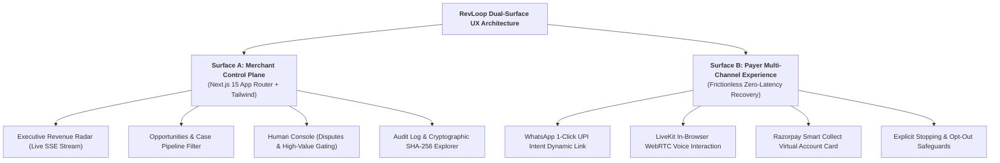

# UI/UX Design System & Operator Control Plane (`UI_UX_design.md`)
## RevLoop AI: Autonomous Closed-Loop Revenue Recovery Engine
**Hackathon Track:** Razorpay Buildathon — Track 03: AI Revenue Recovery  
**Target Platform:** Razorpay Ecosystem (100% Open-Source & Free-Tier Toolchain)  
**Document Version:** 2.4.0-VERIFIED-BENCHMARK  
**Status:** Approved Master UI/UX Specification  

---

## 1. Design North Star & Experience Philosophy

RevLoop AI is engineered to feel like a **calm, high-trust revenue operations control plane**.

The interface exists to answer five critical executive and operational questions immediately:
1. **Where is money slipping away?** (Live detection across checkouts, mandates, and invoices)
2. **Which cases are worth acting on first?** (Severity scoring & recoverable yield)
3. **What does the agent believe is happening?** (Root-cause classification `DGN-01..12` with confidence)
4. **What action is permitted, and why?** (Deterministic policy rule authorization `A1..A11`)
5. **Did the action actually recover money?** (Authoritative Razorpay payment verification)



---

## 2. Core Experience Principles

- **2.1 Revenue First:** Money recovered is the strongest visual hierarchy. Every screen emphasizes rupee values (₹ INR), recovery rates, and net incremental yield.
- **2.2 Trust Through Structured Evidence:** Never expose raw unformatted chain-of-thought. Expose structured rationale: Diagnosis $\rightarrow$ Telemetry $\rightarrow$ Confidence $\rightarrow$ Policy Rule $\rightarrow$ Outcome.
- **2.3 Visual Separation: AI Proposes vs. Policy Decides:** The UI clearly demarcates:
  - *AI Recommendation:* What the model suggests based on diagnosis.
  - *Policy Verdict:* What the deterministic engine allows.
  - *Verification State:* What Razorpay authoritative webhooks confirm.
- **2.4 Least Invasive Effective Action:** The visual design emphasizes gentle, frictionless self-serve retries before escalating to voice or human intervention.
- **2.5 Explicit Stopping Rules:** Users always see why outreach stopped: `Stopped on Settlement`, `Opt-Out Honored`, `Max Attempts Reached`, `PTP Locked`.

---

## 3. Information Architecture

```text
RevLoop Control Plane
│
├── 1. Overview (Revenue Radar)
│   ├── Total Capital at Risk vs. Recovered
│   ├── Incremental Recovery Yield (IRY) Gauge
│   ├── Live Action Stream (Server-Sent Events)
│   └── Channel Recovery Breakdown
│
├── 2. Opportunities & Pipeline
│   ├── All Open Cases
│   ├── Payment Failures & Degradations (DGN-01..05)
│   ├── Involuntary Mandate Churn (DGN-06)
│   ├── Checkout Abandonments (DGN-07)
│   └── Overdue B2B Receivables (DGN-08..11)
│
├── 3. Human Console (Approvals & Disputes)
│   ├── High-Value Invoice Gating (> ₹2,00,000)
│   ├── Disputed Invoices (DGN-09)
│   └── Low-Confidence Triage (DGN-12)
│
├── 4. Promise-to-Pay (PTP) Calendar
│   ├── Active PTP Commitments
│   ├── Reminder Trigger Schedules
│   └── Fulfilled vs. Broken Timeline
│
├── 5. Audit Log & Cryptographic Explorer
│   ├── Append-Only `case_events` Ledger
│   ├── Case-Scoped SHA-256 Hash Chain Inspector
│   └── Case State Projection Rebuilder
│
└── 6. Settings & Guardrails
    ├── Channel Rate Limits & Cooldowns
    ├── Margin Floor Concession Limits (Max %)
    ├── TRAI Operating Hours Configuration
    └── Global Emergency Kill Switch
```

---

## 4. Screen-by-Screen UI Specifications (Next.js 15)

### 4.1 Screen 1: Executive Revenue Radar (Dashboard)
- **Viewport:** Desktop 1440 × 900 primary, fully responsive down to 1024px.
- **Top Metrics Row:**
  - `TOTAL REVENUE AT RISK`: ₹1,24,50,000 (1,000 cases).
  - `TOTAL RECOVERED (TREATED)`: **₹74,84,940** (66.80% Treated Cohort).
  - `INCREMENTAL RECOVERY YIELD (IRY)`: **+49.30%** (Treated 66.80% vs. Holdout Control 17.50%).
  - `NET ROI MULTIPLIER`: **1,542.2x** (Batch Cost: ₹4,850.00, Net Incremental Cash: ₹55.24L).
- **Live Agent Action Stream (Server-Sent Events):** Real-time feed auto-scrolling with color-coded action chips (`VOICE_CONNECTED`, `PTP_LOCKED`, `WHATSAPP_RECOVERED`, `HARD_STOP_TRIGGERED`).

```
┌───────────────────────────────────────────────────────────────────────────────────────────┐
│ 🚀 RevLoop AI | Autonomous Revenue Recovery Control Plane          [Live Mode 🟢] [Admin] │
├─────────────────────┬─────────────────────┬─────────────────────┬─────────────────────────┤
│ REVENUE AT RISK     │ TREATED RECOVERED   │ INCREMENTAL YIELD   │ NET ROI MULTIPLIER      │
│ ₹1,24,50,000        │ ₹74,84,940 (66.8%)  │ +49.30% (vs Control)│ 1,542.2x (Net: ₹55.24L) │
├─────────────────────┴─────────────────────┴─────────────────────┴─────────────────────────┤
│ ⚡ LIVE AGENT ACTION STREAM (Server-Sent Events)                                          │
│ • [10:34:12] 📞 Voice Call Connected: Client 'Sharma TransLogistics' (Invoice #INV-8821) │
│ • [10:34:45] 🔒 PTP Locked: ₹85,000 committed for 26 Aug 11:00 AM (Agent: Aarav)        │
│ • [10:35:01] ⚡ 1-Click WhatsApp Recovered: ₹3,499 (Checkout #ORD-9821 via ICICI UPI)    │
│ • [10:35:18] 🛑 Hard Stop Triggered: Payment #pay_O0k3 verified. Canceled 2 follow-ups. │
├───────────────────────────────────────────────────────────────────────────────────────────┤
│ 📋 ACTIVE RECOVERY CASES (Filter: [All] [Checkouts] [Subscriptions] [B2B Invoices])       │
│ ID         Customer        Entity      Amount     Root Cause       State       Action     │
│ ───────────────────────────────────────────────────────────────────────────────────────── │
│ #REC-9812  Rahul Verma     Checkout    ₹3,499     DGN-05 (TIMEOUT) RECOVERED   [Audit ↗]  │
│ #REC-9813  TechServe Pvt   Invoice     ₹85,000    DGN-08 (OVERDUE) PTP_LOCKED  [Details ↗]│
│ #REC-9814  Anita Desai     Mandate     ₹2,499     DGN-01 (FUNDS)   SCHEDULED   [Pause ⏸]  │
│ #REC-9815  Global Exports  Invoice     ₹3,20,000  DGN-09 (DISPUTE) HITL_REVIEW [Review ⚠] │
└───────────────────────────────────────────────────────────────────────────────────────────┘
```

---

### 4.2 Screen 2: Case Detail & Evidence Drawer
When an operator clicks a case, a sliding drawer opens from the right (width: 540px):
- **Case Summary:** Customer pseudonym, amount at risk, creation timestamp, holdout status.
- **Diagnostic Breakdown:**
  - Detected Category: `DGN-05: technical_gateway_timeout`.
  - Confidence: `0.94` (Rule-resolved).
  - Telemetry Context: *HDFC UPI experienced $\ge 30\%$ failure surge; recovered to $\ge 90\%$ uptime at 10:38 AM.*
- **Policy Decision:** Rule `POL-03` triggered $\rightarrow$ Action `A4: send_reminder_with_link`.
- **Audit Timeline:** Interactive visual timeline displaying each event in `case_events` with per-case SHA-256 hashes.

---

### 4.3 Screen 3: Human Console (Dispute & High-Value Approvals)
```
┌────────────────────────────────────────────────────────────────────────┐
│ ⚠️ Human Console: Case #REC-9815 (Global Exports Ltd)                 │
├────────────────────────────────────────────────────────────────────────┤
│ • Invoice ID: #INV-4921 | Amount: ₹3,20,000 | Overdue: 22 Days         │
│ • Flagged Reason: Customer reported 10% damaged items on delivery      │
│ • AI Voice Transcript Excerpt:                                         │
│   "Customer: Arre sir 5 cartons damaged aaye the, isliye hold kiya."  │
│ • Recommended Action: Issue ₹32,000 credit note & send ₹2,88,000 link  │
├────────────────────────────────────────────────────────────────────────┤
│ Actions:                                                               │
│ [ Approve Credit Note & Send Link ]  [ Re-assign to Sales ]  [ Dismiss ]│
└────────────────────────────────────────────────────────────────────────┘
```

---

## 5. End-Payer Multi-Channel UX Specifications

### 5.1 WhatsApp 1-Click Interactive Recovery Template
```
┌────────────────────────────────────────────────────────┐
│  [Merchant Brand Logo] TechServe Official ✅          │
│                                                        │
│  Hi Rahul! 👋                                          │
│                                                        │
│  We noticed your payment of *₹3,499* for Order         │
│  *#ORD-9821* got interrupted due to bank gateway      │
│  latency on HDFC UPI.                                  │
│                                                        │
│  Your items are reserved for the next *15 minutes*.    │
│  Tap below to complete your order instantly:           │
│                                                        │
│  ┌──────────────────────────────────────────────────┐  │
│  │ ⚡ Pay ₹3,499 with 1-Click UPI (GPay / PhonePe)  │  │
│  └──────────────────────────────────────────────────┘  │
│  ┌──────────────────────────────────────────────────┐  │
│  │ 💳 Pay with Credit / Debit Card or NetBanking     │  │
│  └──────────────────────────────────────────────────┘  │
│  ┌──────────────────────────────────────────────────┐  │
│  │ ⏰ Remind Me Tomorrow                             │  │
│  └──────────────────────────────────────────────────┘  │
│                                                        │
│  Reply *STOP* to opt-out of automated notifications.   │
└────────────────────────────────────────────────────────┘
```

---

## 6. Design System Tokens & Color Palette

| Design Token | Light Mode Value | Dark Mode Value | Semantic Role |
| :--- | :--- | :--- | :--- |
| `color-brand-primary` | `#0C2340` (Razorpay Dark Navy) | `#3B82F6` (Electric Blue) | Primary branding & top navigation |
| `color-recovery-success` | `#059669` (Emerald Green) | `#10B981` (Green Glow) | Recovered revenue & verified settlements |
| `color-risk-alert` | `#DC2626` (Ruby Red) | `#EF4444` (Crimson) | Failed transactions & dispute escalations |
| `color-ptp-amber` | `#D97706` (Amber Gold) | `#F59E0B` (Gold) | Active Promise-to-Pay hold commitments |
| `color-surface-bg` | `#F8FAFC` (Slate 50) | `#0B1120` (Obsidian Slate) | Main dashboard canvas background |
| `font-family-sans` | `Inter, -apple-system, sans-serif` | Typography across all views |
